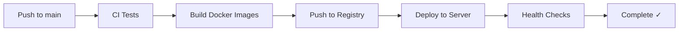

# Automated Deployment Guide

## Overview

EthHook now has a **fully automated deployment system** that handles:

✅ Building all services  
✅ Running tests  
✅ Building Docker images  
✅ Pushing to GitHub Container Registry  
✅ Deploying to production server  
✅ Health checks and rollback

## Quick Start

### 1. One-Command Deployment

```bash
# Complete automated deployment
make all

# Deploy to server
make deploy DO_HOST=your-server-ip
```

### 2. Using the Deployment Script

```bash
# Full pipeline (build + test + docker + push + deploy)
./deploy-auto.sh full your-server-ip

# Build only
./deploy-auto.sh build

# Test only
./deploy-auto.sh test

# Build Docker images
./deploy-auto.sh docker

# Quick update (pull + restart)
./deploy-auto.sh quick-deploy your-server-ip
```

## Makefile Targets

### Development

```bash
make help              # Show all available commands
make setup             # Initial project setup
make build             # Build Rust binaries
make test              # Run all tests
make lint              # Run clippy and format checks
make format            # Format code
make security-audit    # Run security audit
```

### Docker

```bash
make docker-build      # Build all Docker images
make docker-push       # Push images to registry
make docker-login      # Login to GitHub Container Registry
```

### Local Development

```bash
make local-up          # Start services locally
make local-down        # Stop local services
make local-logs        # View logs

make dev-admin-api     # Run admin-api in dev mode
make dev-pipeline      # Run pipeline in dev mode
make dev-ui            # Run UI in dev mode
```

### Production

```bash
make prod-up           # Start production services locally
make prod-down         # Stop production services

make deploy DO_HOST=1.2.3.4        # Deploy to server
make deploy-quick DO_HOST=1.2.3.4  # Quick update
make deploy-logs DO_HOST=1.2.3.4   # View server logs
make deploy-status DO_HOST=1.2.3.4 # Check service status
```

### CI/CD

```bash
make ci                # Run all CI checks locally
make all               # Complete build + test + push pipeline
make release           # Create release build
```

## GitHub Actions Workflows

### Automated on Push to Main

When you push to the `main` branch, GitHub Actions automatically:

1. **CI Pipeline** (`.github/workflows/ci.yml`)
   - Runs all tests
   - Checks code formatting
   - Runs security audit
   - Builds all services
   - Generates code coverage

2. **Docker Build & Push** (`.github/workflows/ci.yml`)
   - Builds Docker images for all services
   - Pushes to `ghcr.io/ipcasj/ethhook-*:latest`
   - Tags with commit SHA

3. **Deploy to Production** (`.github/workflows/deploy-digitalocean.yml`)
   - Pulls latest images on server
   - Restarts services
   - Runs health checks
   - Reports deployment status

### Manual Deployment

Trigger deployment manually from GitHub Actions UI:
1. Go to "Actions" tab
2. Select "Deploy to DigitalOcean"
3. Click "Run workflow"
4. Select branch and run

## Environment Setup

### Required Secrets (GitHub)

Configure these in: **Settings → Secrets and variables → Actions**

```bash
DO_HOST              # Production server IP (e.g., 147.182.123.456)
DO_SSH_PRIVATE_KEY   # SSH private key for server access
GITHUB_TOKEN         # Auto-provided by GitHub
CLICKHOUSE_PASSWORD  # ClickHouse database password
JWT_SECRET           # JWT signing secret
```

### Environment Files

Create `.env.production` from template:

```bash
cp .env.digitalocean.example .env.production
```

Edit and fill in:
- `CLICKHOUSE_PASSWORD`
- `JWT_SECRET`
- WebSocket URLs for blockchain nodes

## Deployment Workflow

### Automatic (Recommended)



### Manual

```bash
# 1. Build and test locally
make ci

# 2. Build Docker images
make docker-build

# 3. Push to registry (requires login)
echo $GITHUB_TOKEN | docker login ghcr.io -u $GITHUB_ACTOR --password-stdin
make docker-push

# 4. Deploy to server
make deploy DO_HOST=your-server-ip
```

## Server Setup (One-Time)

### 1. Create DigitalOcean Droplet

- **OS**: Ubuntu 22.04 LTS
- **Size**: 4GB RAM minimum (8GB recommended)
- **Add SSH key** for access

### 2. Install Docker on Server

```bash
ssh root@your-server-ip

# Install Docker
curl -fsSL https://get.docker.com -o get-docker.sh
sh get-docker.sh

# Install Docker Compose
apt-get update
apt-get install docker-compose-plugin
```

### 3. Create Project Directory

```bash
mkdir -p ~/ethhook
cd ~/ethhook
```

### 4. Initial Deployment

```bash
# From your local machine
make deploy DO_HOST=your-server-ip
```

## Service Architecture

### Deployed Services

```yaml
admin-api:          # Port 3000 - REST API
pipeline:           # Port 8080 - WebSocket + Processing
ui:                 # Port 3002 - Next.js Frontend
clickhouse:         # Port 8123 - Event database
grafana:            # Port 3001 - Monitoring dashboard
```

### Data Persistence

```yaml
volumes:
  admin_data:       # SQLite database (config.db)
  pipeline_data:    # SQLite database (config.db)
  clickhouse_data:  # Event storage
  grafana_data:     # Dashboards and config
```

## Monitoring Deployment

### Check Service Status

```bash
# From server
docker-compose ps

# From local machine
make deploy-status DO_HOST=your-server-ip
```

### View Logs

```bash
# All services
make deploy-logs DO_HOST=your-server-ip

# Specific service
ssh root@your-server-ip
cd ~/ethhook
docker-compose logs -f admin-api
```

### Health Checks

```bash
# API health
curl http://your-server-ip:3000/health

# Pipeline health
curl http://your-server-ip:8080/health

# UI (returns HTML)
curl http://your-server-ip:3002
```

## Troubleshooting

### Deployment Failed

```bash
# Check logs on server
make deploy-logs DO_HOST=your-server-ip

# Manual rollback
ssh root@your-server-ip
cd ~/ethhook
docker-compose down
docker-compose pull
docker-compose up -d
```

### Service Not Starting

```bash
# Check specific service logs
ssh root@your-server-ip
cd ~/ethhook
docker-compose logs admin-api

# Restart specific service
docker-compose restart admin-api
```

### Database Issues

```bash
# Reset database (CAUTION: deletes data)
ssh root@your-server-ip
cd ~/ethhook
docker-compose down
rm -rf admin_data pipeline_data
docker-compose up -d
```

### Image Pull Failed

```bash
# Login to registry on server
ssh root@your-server-ip
echo $GITHUB_TOKEN | docker login ghcr.io -u $GITHUB_ACTOR --password-stdin
cd ~/ethhook
docker-compose pull
```

## Quick Reference

### Most Common Commands

```bash
# Development
make build              # Build everything
make test               # Run tests
make local-up           # Start locally

# Deployment
make all                # Full CI/CD pipeline
make deploy DO_HOST=ip  # Deploy to server

# Monitoring
make deploy-status      # Check services
make deploy-logs        # View logs
```

### Service URLs (Production)

```bash
Frontend:   http://your-server-ip:3002
Admin API:  http://your-server-ip:3000
Grafana:    http://your-server-ip:3001
```

## Performance Tuning

### Resource Limits

Edit `docker-compose.prod.yml` to adjust:

```yaml
admin-api:
  deploy:
    resources:
      limits:
        cpus: '1'
        memory: 512M
      reservations:
        cpus: '0.5'
        memory: 256M
```

### Scaling

```bash
# Scale pipeline workers
docker-compose up -d --scale pipeline=3

# Check scaled services
docker-compose ps
```

## Security Checklist

- [ ] Change default JWT_SECRET
- [ ] Use strong CLICKHOUSE_PASSWORD
- [ ] Configure firewall (UFW)
- [ ] Set up SSL/TLS (Caddy or nginx)
- [ ] Enable log rotation
- [ ] Set up automated backups
- [ ] Configure fail2ban
- [ ] Use SSH key authentication only

## Next Steps

After successful deployment:

1. **Access UI**: http://your-server-ip:3002
2. **Create admin account** using set_admin script
3. **Create application** via UI
4. **Set up endpoints** for webhooks
5. **Configure monitoring** in Grafana
6. **Set up custom domain** (optional)
7. **Enable SSL** (recommended)

## Support

For issues or questions:
- Check logs: `make deploy-logs DO_HOST=your-server-ip`
- Review documentation in `/docs`
- Check GitHub Issues
- Review POSTGRESQL_REMOVAL_COMPLETE.md for database info
